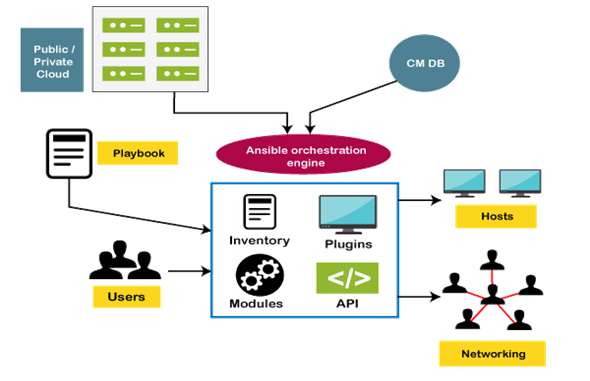

# 👋 Welcome to Ansible

<mark style="color:green;">**Introduction:**</mark> Welcome to a new course from the DevOps Engineer package From [www.devopscity.net](./) Produced by Vahireza Jafary. In this course, we will get to know Ansible, and we will advance this course together in a practical and project-oriented way.


## <mark style="color:green;">Ansible Tutorial</mark>

Ansible tutorial provides basic and advanced concepts of Ansible. Our Ansible tutorial is designed for beginners and professionals.\
Ansible is an open-source IT engine which automates the IT tools such as intra service orchestration, application deployment, cloud provisioning, etc.

<mark style="color:orange;">**What is Ansible?**</mark>

Ansible is an open-source IT engine that automates application deployment, cloud provisioning, intra service orchestration, and other IT tools.

Ansible is easy to deploy because it does not use any **agents** or **custom security** infrastructure on the client-side, and by pushing modules to the clients. These modules are executed locally on the client-side, and the output is pushed back to the Ansible server.\

It can easily connect to clients using **SSH-Keys**, simplifying though the whole process. Client details, such as **hostnames** or **IP addresses** and **SSH ports**, are stored in the files, which are called inventory files. If you created an inventory file and populated it, then Ansible can use it.

Ansible uses the playbook to describe automation jobs, and playbook, which uses simple language, i.e., **YAML**. YAML is a human-readable data serialization language & commonly used for configuration files, but it can be used in many applications where data is being stored.

A significant advantage is that even the IT infrastructure support guys can read and understand the playbook and debug if needed.

Ansible is designed for multi-tier deployment. Ansible does not manage one system at a time, and it models IT infrastructure by describing all of your systems are interrelated. Ansible is entirely agentless, which means Ansible works by connecting your nodes through **SSH** (by default). Ansible gives the option to you if you want another method for the connection, like **Kerberos**.

Ansible pushes small programs after connecting to your nodes, which are known as "**Ansible Modules**". Ansible runs that module on your nodes and removes them when finished. Ansible manages the inventory in simple text files (These are the host's files). Ansible uses the host file where one can group the hosts and can control the actions on a specific group in the playbooks.

### Why Use Ansible

Here are some important reasons for using Ansible, such as:

* Ansible is free to use by everyone.
* Ansible is very consistent and lightweight, and no constraints regarding the operating system or underlying hardware are present.
* It is very secure due to its agentless capabilities and open **SSH** security features.
* Ansible does not need any special system administrator skills to install and use it.
* Ansible has a smooth learning curve, determined by the comprehensive documentation and easy to learn structure and configuration.
* Its modularity regarding **plugins, inventories, modules,** and **playbooks** make Ansible perfect companion to orchestrate large environments.

\

## <mark style="color:green;">Ansible Workflow</mark>

Ansible works by connecting to your nodes and pushing out a small program called **Ansible modules** to them. Then Ansible executed these modules and removed them after finished. The library of modules can reside on any machine, and there are no daemons, **servers,** or **databases** required.

<figure><figcaption>
<strong>How It Works</strong>
</figcaption></figure>

In the above image, the **Management Node** is the controlling node that controls the entire execution of the playbook. The **inventory** file provides the list of hosts where the Ansible modules need to be run. The **Management Node** makes an **SSH** connection and executes the small modules on the host's machine and install the software.

Ansible removes the modules once those are installed so expertly. It connects to the host machine executes the instructions, and if it is successfully installed, then remove that code in which one was copied on the host machine.

### <mark style="color:orange;">Terms used in Ansible</mark>

Here are some important terms which are used in Ansible, such as:

| Terms          | Explanation                                                                                               |
| -------------- | --------------------------------------------------------------------------------------------------------- |
| Ansible Server | It is a machine where Ansible is installed and from which all tasks and playbooks will be executed.       |
| Modules        | The module is a command or set of similar commands which is executed on the client-side.                  |
| Task           | A task is a section which consists of a single procedure to be completed.                                 |
| Role           | It is a way of organizing tasks and related files to be later called in a playbook.                       |
| Fact           | The information fetched from the client system from the global variables with the gather facts operation. |
| Inventory      | A file containing the data regarding the Ansible client-server.                                           |
| Play           | It is the execution of the playbook.                                                                      |
| Handler        | The task is called only if a notifier is present.                                                         |
| Notifier       | The section attributed to a task which calls a handler if the output is changed.                          |
| Tag            | It is a name set to a task that can be used later on to issue just that specific task or group of jobs.   |

\

## <mark style="color:green;">**Ansible Architecture:**</mark>

The Ansible orchestration engine interacts with a user who is writing the Ansible playbook to execute the Ansible orchestration and interact along with the services of private or public cloud and configuration management database. You can show in the below diagram, such as:

<figure><figcaption>
<strong>Ansible Architecture</strong>
</figcaption></figure>

<mark style="color:orange;">**Inventory**</mark>

Inventory is lists of nodes or hosts having their IP addresses, databases, servers, etc. which are need to be managed.

#### <mark style="color:orange;">API's</mark>

The Ansible API's works as the transport for the public or private cloud services.

#### <mark style="color:orange;">Modules</mark>

Ansible connected the nodes and spread out the Ansible modules programs. Ansible executes the modules and removed after finished. These modules can reside on any machine; no database or servers are required here. You can work with the chose text editor or a terminal or version control system to keep track of the changes in the content.

<mark style="color:orange;">**Plugins**</mark>

Plugins is a piece of code that expends the core functionality of Ansible. There are many useful plugins, and you also can write your own.

#### <mark style="color:orange;">Playbooks</mark>

Playbooks consist of your written code, and they are written in YAML format, which describes the tasks and executes through the Ansible. Also, you can launch the tasks synchronously and asynchronously with playbooks.

#### <mark style="color:orange;">Hosts</mark>

In the Ansible architecture, hosts are the node systems, which are automated by Ansible, and any machine such as RedHat, Linux, Windows, etc.

#### <mark style="color:orange;">Networking</mark>

Ansible is used to automate different networks, and it uses the simple, secure, and powerful agentless automation framework for IT operations and development. It uses a type of data model which separated from the Ansible automation engine that spans the different hardware quite easily.

#### <mark style="color:orange;">Cloud</mark>

A cloud is a network of remote servers on which you can store, manage, and process the data. These servers are hosted on the internet and storing the data remotely rather than the local server. It just launches the resources and instances on the cloud, connect them to the servers, and you have good knowledge of operating your tasks remotely.

#### <mark style="color:orange;">CMDB</mark>

CMDB is a type of repository which acts as a data warehouse for the IT installations.\

****

****

\
